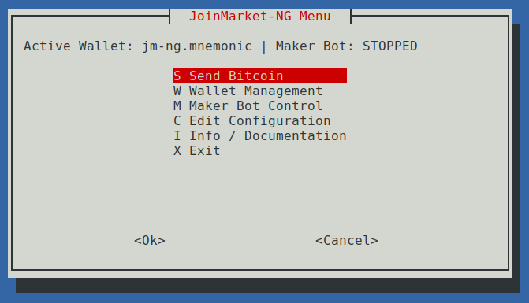
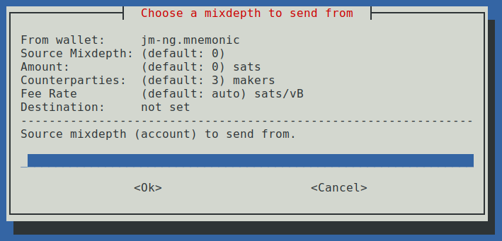
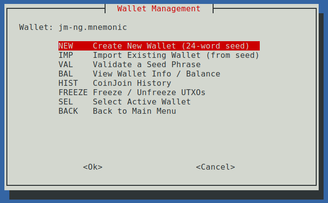
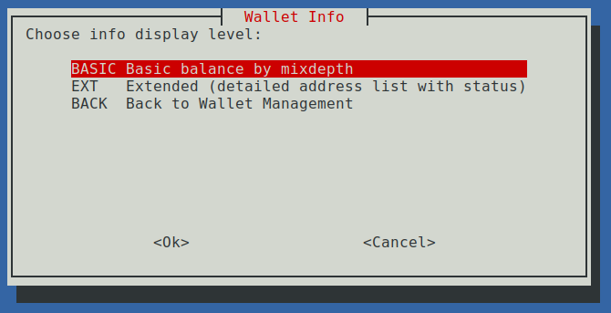
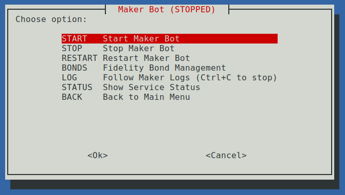
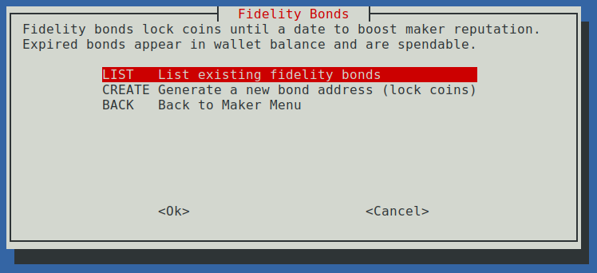

# TUI Menu

The JoinMarket-NG TUI is a terminal-based graphical menu interface built on `whiptail`. It wraps the JoinMarket-NG CLI tools so users can perform CoinJoin operations, manage wallets, and control the maker bot without memorizing command-line flags.

The same script works on both **Raspiblitz** (uses the bonus script for privileged maker control) and **standalone** systems (uses direct CLI commands). The environment is auto-detected at startup.

## Install

The `jm-ng` command is included with the **jmcore** package. After
installing jmcore (e.g. `pip install jmcore`), the `jm-ng` entry point
is available directly:

```bash
jm-ng
```

**Raspiblitz** installs the script automatically as `/home/joinmarketng/menu.sh`.

### Prerequisites

- `whiptail` (usually pre-installed on Debian/Ubuntu; `sudo apt install whiptail`)
- JoinMarket-NG CLI tools in `$PATH` (`jm-wallet`, `jm-maker`, `jm-taker`)
- Data directory and config at `~/.joinmarket-ng/`

## Main Menu



The main menu provides access to all JoinMarket-NG operations. The header shows the current active wallet and maker service status.

| Option | Description |
|--------|-------------|
| **S** | Send Bitcoin (normal transaction or CoinJoin) |
| **W** | Wallet Management |
| **M** | Maker Bot Control |
| **C** | Edit Configuration (`config.toml`) |
| **I** | Info / Documentation |
| **X** | Exit |

## Send Bitcoin



Configure your Bitcoin send parameters. Set the number of counterparties to **0** for a normal transaction or **4-10** for a CoinJoin. The display shows current values as you input each parameter.

| Parameter | Description |
|-----------|-------------|
| **Mixdepth** | Source account (mixdepth) to send from |
| **Amount** | Satoshis to send (0 = sweep entire mixdepth) |
| **Counterparties** | Number of makers (0 = normal, >0 = CoinJoin) |
| **Fee Rate** | Fee Rate in sats/vB (leave blank for auto-estimate) |
| **Destination** | Bitcoin address or "INTERNAL" for CoinJoin sweep |

## Wallet Management



Manage wallets through this submenu. Create new wallets, import from seed, validate seed phrases, check balances, view CoinJoin history, and freeze/unfreeze UTXOs.

| Option | Description |
|--------|-------------|
| **NEW** | Create a new wallet with a 12- or 24-word BIP39 seed |
| **IMP** | Import an existing wallet (12 or 24 words) |
| **VAL** | Validate a seed phrase before importing |
| **BAL** | View wallet info / balance (basic or extended) |
| **HIST** | Display CoinJoin transaction history |
| **FREEZE** | Freeze or unfreeze individual UTXOs |
| **SEL** | Select the active wallet from available wallets |
| **BACK** | Return to the main menu |

### Wallet Info



| Option | Description |
|--------|-------------|
| **BASIC** | Quick balance summary by mixdepth (account) |
| **EXT** | Extended view with detailed address list and status labels |
| **BACK** | Return to Wallet Management |

**BASIC** shows total balance and individual balance per mixdepth.
**EXT** shows all addresses with derivation paths, status labels (`new`, `deposit`, `cj-out`, `non-cj-change`, `used-empty`, `flagged`), individual balances, and mixdepth totals.

## Maker Bot Control



Control the maker bot service. As a Maker, you advertise your coins on the JoinMarket network for use in CoinJoins and earn fees.

On Raspiblitz, maker control uses systemd via the bonus script. On standalone systems, it manages the `jm-maker` process directly.

| Option | Description |
|--------|-------------|
| **START** | Start the maker service |
| **STOP** | Stop the maker service |
| **RESTART** | Restart the maker service |
| **BONDS** | Manage Fidelity Bonds (boost maker reputation) |
| **LOG** | Follow maker logs in real-time (Ctrl+C to stop) |
| **STATUS** | Display current service status |
| **BACK** | Return to the main menu |

## Fidelity Bonds



Fidelity bonds lock coins until a specified date to boost your maker reputation score, increasing the likelihood of being matched in CoinJoins.

| Option | Description |
|--------|-------------|
| **LIST** | View all existing fidelity bonds and their lock dates |
| **CREATE** | Generate a new bond address and lock coins until a future date |
| **BACK** | Return to the Maker Menu |

## Environment Detection

The script auto-detects its environment at startup:

- **Raspiblitz**: If `/home/admin/config.scripts/bonus.joinmarket-ng.sh` exists, maker operations use `sudo` calls to the bonus script for systemd service management and password storage.
- **Standalone**: Otherwise, the script uses `$(whoami)` for user detection, direct `jm-maker` commands for maker control, and writes passwords directly to `config.toml`.

For script inventory and related tooling, see [Scripts](README-scripts.md).
